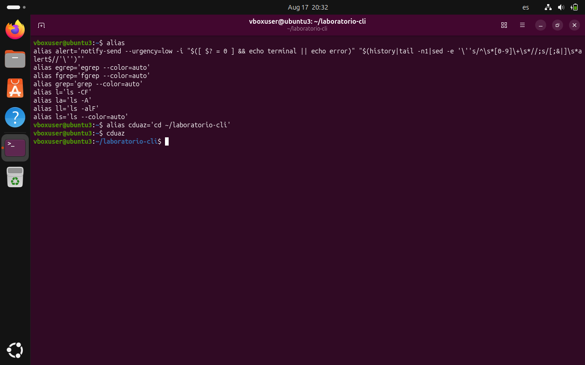

## Alias en ubuntu linux
1-Verificamos los alias que tenemos activos 

2-Creamos un nuevo alias (cduaz)

3-Buscamos si el alias ll ya existe

4-Asignar y guardar el nuevo valor para el alias ll y volver a cargar el archivo

5-Verificar el tipo del alias ll

6-Comprobar todos los alias nuevamente

